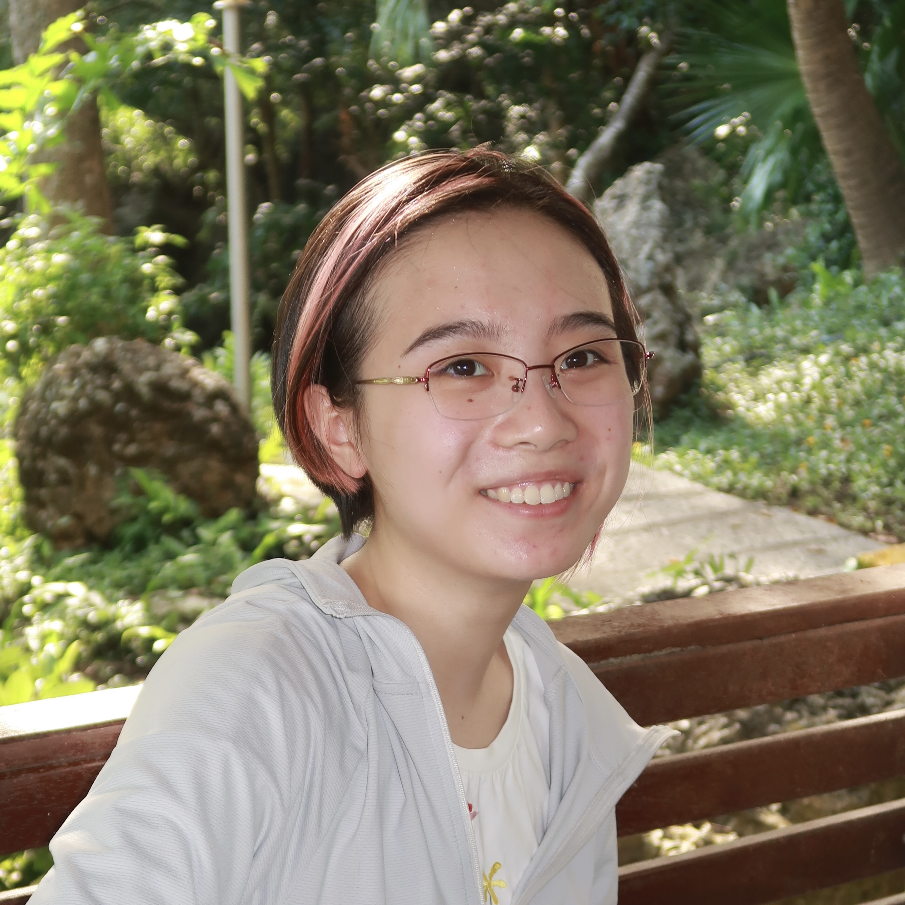
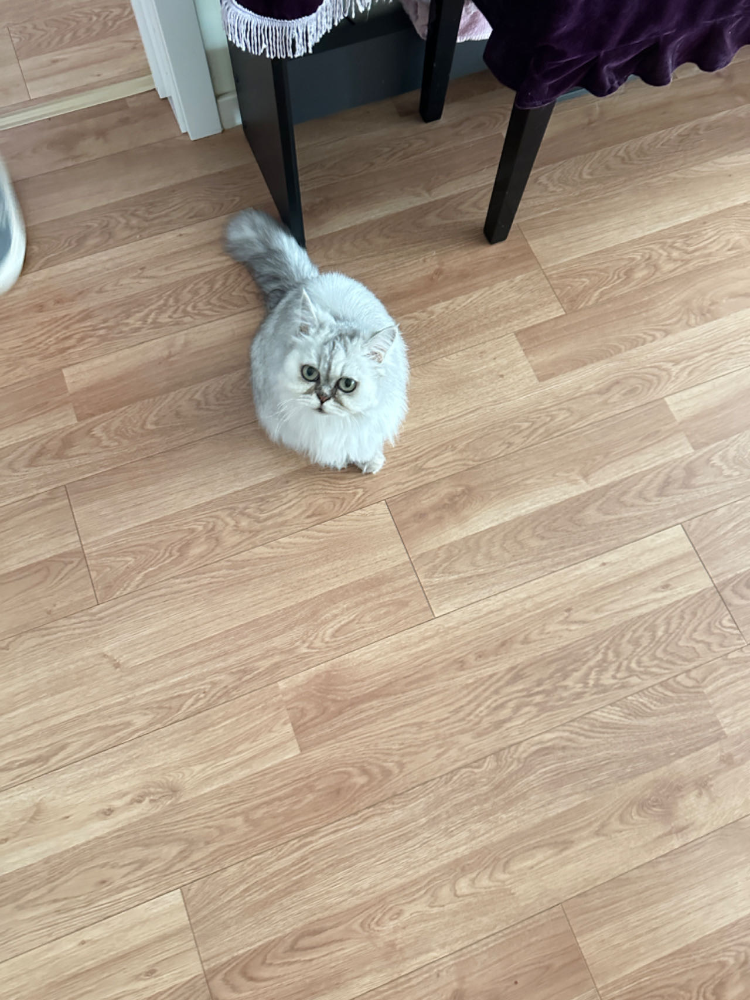

## Introduction

Hi! I am Alice Zhou. I am a first-year MS student in Biostatistics at Columbia Mailman School of Public Health. Before attending Columbia, I studied Psychology and Philosophy at NYU.

## Self Identity

\#Polyglot

\#Dance Enthusiast

\#Avid Concert Goer

\#Pretty Bad Surfer

\#Foodie

\#Made in China

\#Pride

This is my cat 咪咪("MiMi"). She is a great cat!

If you'd like to learn more about me, you can read my [CV](cv.html).